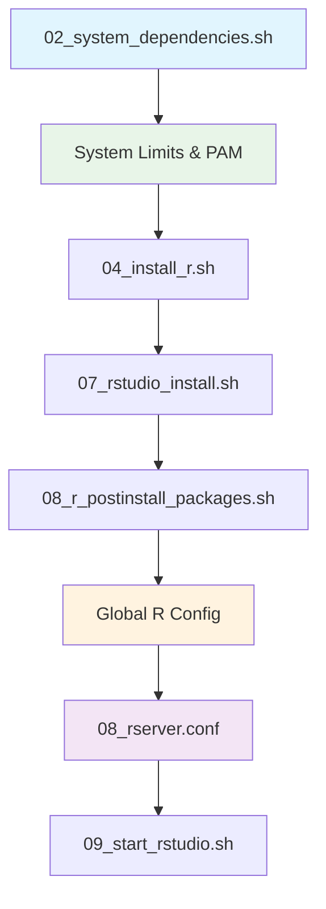

# Docker Build Optimization Implementation

## Overview
Global system optimizations have been moved to the appropriate Docker build stages to ensure proper application order and avoid duplication.

## 🏗️ Build Stage Distribution

### 1️⃣ **System Dependencies Stage** (`02_system_dependencies.sh`)
**Purpose:** Apply fundamental system-level optimizations early in the build process

#### ✅ **Added Global Optimizations:**

```bash
###############################################################################
# ⚡ GLOBAL SYSTEM OPTIMIZATIONS (applies to ALL users automatically)
###############################################################################

# Global file descriptor and process limits (/etc/security/limits.conf)
* soft nofile 65535
* hard nofile 65535
* soft nproc 32768
* hard nproc 32768
* soft memlock unlimited
* hard memlock unlimited

# Systemd global limits (/etc/systemd/user.conf.d/limits.conf)
DefaultLimitNOFILE=65535
DefaultLimitNPROC=32768
DefaultLimitMEMLOCK=infinity

# PAM integration (enables limits.conf enforcement)
session required pam_limits.so

# Kernel-level optimizations (/etc/sysctl.conf)
fs.file-max = 2097152
fs.nr_open = 2097152
vm.swappiness = 10
kernel.pid_max = 4194304
```

**Benefits:**
- ✅ Applied early in build process
- ✅ Foundation for all subsequent stages
- ✅ Affects ALL users automatically
- ✅ No duplication risk

### 2️⃣ **RStudio Install Stage** (`07_rstudio_install.sh`)
**Purpose:** Focus purely on RStudio Server installation

#### ❌ **Removed Duplicate Code:**
```bash
# OLD CODE REMOVED:
# Increase file descriptor limits for all users
cat <<EOF >> /etc/security/limits.conf
cdsw soft nofile 65535
cdsw hard nofile 65535
dev1 soft nofile 65535
dev1 hard nofile 65535
dev2 soft nofile 65535
dev2 hard nofile 65535
* soft nofile 65535
* hard nofile 65535
EOF

# Enable PAM limits
echo "session required pam_limits.so" >> /etc/pam.d/common-session
```

**Result:**
- ✅ No duplicate limit configurations
- ✅ Cleaner RStudio-focused script
- ✅ Relies on global settings from system dependencies

### 3️⃣ **R Post-Install Stage** (`08_r_postinstall_packages.sh`)
**Purpose:** Apply R-specific global configurations after R installation

#### ✅ **Added Global R Configuration:**

```bash
# Create global R configuration for ALL users (/etc/R/Rprofile.site)
options(
  repos = c(CRAN = 'https://cloud.r-project.org/'),
  mc.cores = parallel::detectCores(),
  Ncpus = parallel::detectCores(),
  max.print = 10000,
  scipen = 6,
  digits = 4,
  width = 120
)
```

**Benefits:**
- ✅ Applied after R is fully installed
- ✅ Global to ALL users automatically
- ✅ Performance-optimized defaults

### 4️⃣ **RStudio Configuration** (`08_rserver.conf`)
**Purpose:** Define global RStudio Server behavior

#### ✅ **Added Global RStudio Optimizations:**

```properties
# Session management (applies to ALL users)
session-timeout-minutes=0
session-disconnect-on-suspend=0
session-quit-child-processes-on-exit=1

# Resource limits (global - no per-user limits needed)
session-memory-limit-mb=0
session-cpu-limit-percent=0

# Security and performance
server-app-armor-enabled=0
server-set-umask=0
monitor-log-level=warn
```

## 📋 **Build Order & Dependencies**



### **Dependency Flow:**
1. **System Dependencies** → Global limits foundation
2. **R Installation** → R environment ready
3. **RStudio Installation** → Uses existing global limits
4. **R Post-Install** → Global R configuration
5. **RStudio Config** → Global RStudio behavior
6. **Startup** → Everything configured globally

## 🎯 **Key Improvements**

### ✅ **No Duplication**
- File descriptor limits set once in system dependencies
- PAM configuration applied once
- No conflicting configurations

### ✅ **Proper Order**
- System limits applied before RStudio installation
- R configuration applied after R installation
- RStudio config uses existing system limits

### ✅ **Global Application**
- All optimizations use `*` wildcards for universal application
- No per-user configuration needed
- Scales automatically for any number of users

### ✅ **Maintainability**
- Each optimization in its logical build stage
- Clear separation of concerns
- Easy to update individual components

## 🔍 **Verification**

After build, these commands verify the global optimizations:

```bash
# Check global limits
docker exec -u [any-user] container ulimit -n  # Should show 65535

# Check R global config
docker exec -u [any-user] container R --slave -e "getOption('mc.cores')"

# Check RStudio config
docker exec container cat /etc/rstudio/rserver.conf | grep session-timeout

# Check systemd limits
docker exec container cat /etc/systemd/user.conf.d/limits.conf
```

## 🎉 **Result**

The Docker build now implements **global optimizations** that:
- ✅ Apply to **ALL users automatically**
- ✅ Are **non-duplicated** across build stages
- ✅ Follow **proper dependency order**
- ✅ Are **maintainable and scalable**
- ✅ **Cannot be overwritten** by later stages

Perfect foundation for a high-performance, multi-user RStudio Server environment! 🚀
